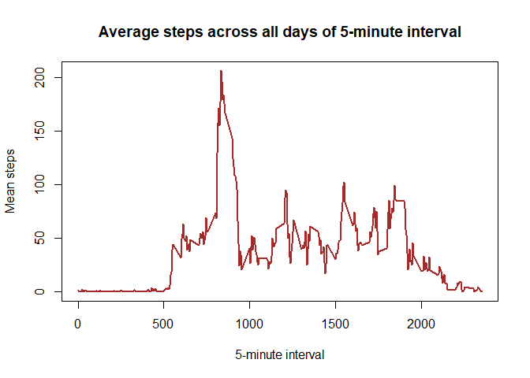

## Loading dplyr for data manipulation

```r
library(dplyr)
```

```
## 
## Attaching package: 'dplyr'
```

```
## The following objects are masked from 'package:stats':
## 
##     filter, lag
```

```
## The following objects are masked from 'package:base':
## 
##     intersect, setdiff, setequal, union
```


## Loading and preprocessing the data


```r
unzip("activity.zip")
activity <- read.csv("activity.csv")
```


## What is mean total number of steps taken per day?

Use tapply function to take sum by each day

```r
daysteps <- tapply(activity$steps, activity$date, sum, na.rm = TRUE)
png(filename = "figures/hist_total.png")
hist(daysteps, main = "Total number of steps taken each day")
dev.off()
```

```
## png 
##   2
```

From the histogram we see, that many people walk from 10 to 15 thousand steps per day.

Let's count the mean and median of the total number of steps taken per day


```r
stepmean <- round(mean(daysteps))
stepmedian <- median(daysteps)
```
So the mean is 9354 and median is 10395 The median is larger, which means, that the distribution is right skewed (we also see this from the histogram)

## What is the average daily activity pattern?


```r
mean_by_interval <- activity %>%
  group_by(interval) %>%
  summarise(mean(steps, na.rm = TRUE))
```

```
## `summarise()` ungrouping output (override with `.groups` argument)
```

```r
plot(mean_by_interval, ylab = "Mean steps", xlab = "5-minute interval", col = "brown",
     type = "l", main = "Average steps across all days of 5-minute interval", lwd = 2)
```

<!-- -->

Let's figure our which 5-minute interval, on average across all the days in the dataset, contains the maximum number of steps


```r
as.numeric(mean_by_interval[which.max(mean_by_interval$`mean(steps, na.rm = TRUE)`),1])
```

```
## [1] 835
```


## Imputing missing values

First, count all the NA values in the dataset

```r
count_na <- sapply(activity, function(x){sum(is.na(x))})
count_na
```

```
##    steps     date interval 
##     2304        0        0
```
Only "steps' feature has NAs: 2304

To impute missing values, I would use the average number of steps for a corresponding
time period across all the days


```r
activity_filled <- activity
for (i in which(is.na(activity$steps))){
  get_interval <- activity[i,3]
  activity_filled[i,1] <- as.numeric(mean_by_interval[mean_by_interval$interval == get_interval,2])
}
```

Activity_filled dataset has been created with imputed values. Now we can make sure that no NA left


```r
sum(is.na(activity_filled$steps))
```

```
## [1] 0
```


Next, make a histogram of total steps per day


```r
daysteps_imputed <- tapply(activity_filled$steps, activity$date, sum)
hist(daysteps_imputed, main = "Total number of steps taken each day with imputed values")
```

<!-- -->

And we can also compare a histogram with imputed values with an initial histogram.
Plot them again, but now together


```r
par(mfcol = c(1,2))
hist(daysteps, main = "Total number of steps taken each day")
hist(daysteps_imputed, main = "Total number of steps taken each day with imputed values")
```

<!-- -->

The histograms a little different, and the new histogram reminds normal distribution a little more. And the number of days that have from 0 to 5000 steps has been double reduced. 

Is there any changes in the mean and median?


```r
stepmean_imputed <- round(mean(daysteps_imputed))
stepmedian_imputed <- round(median(daysteps_imputed))

paste("initial mean:", stepmean, ";", "imputed mean:", stepmean_imputed)
```

```
## [1] "initial mean: 9354 ; imputed mean: 10766"
```

```r
paste("initial median:", stepmedian, ";", "imputed median:", stepmedian_imputed)
```

```
## [1] "initial median: 10395 ; imputed median: 10766"
```
Interesting, mean and median became the same numbers, what a coincidence!


## Are there differences in activity patterns between weekdays and weekends?

First, create a new factor variable in the dataset with two levels – “weekday” and “weekend” indicating whether a given date is a weekday or weekend day


```r
activity_filled$date <- as.Date(activity_filled$date)
activity_filled <- mutate(activity_filled,
       daytype = if_else(weekdays(activity_filled$date) == "Saturday", "weekend", if_else(weekdays(activity_filled$date) == "Sunday", "weekend", "weekday")))
```

Last step, to compare weekdays with weekends we will make a panel plot containing a time series plot of the 5-minute interval and the average number of steps taken, averaged across all weekday days or weekend days


```r
mean_wday <- activity_filled %>%
  filter(daytype == "weekday") %>%
  group_by(interval) %>%
  summarise(mean(steps, na.rm = TRUE))
```

```
## `summarise()` ungrouping output (override with `.groups` argument)
```

```r
mean_wend <- activity_filled %>%
  filter(daytype == "weekend") %>%
  group_by(interval) %>%
  summarise(mean(steps, na.rm = TRUE))
```

```
## `summarise()` ungrouping output (override with `.groups` argument)
```

```r
par(mfrow = c(2,1))
plot(mean_wday, type="l", col = "blue", ylab = "total steps",
     main = "Total steps across weekdays")

plot(mean_wend, type="l", col = "red", ylab = "total steps",
     main = "Total steps across weekends")
```

<!-- -->

Interestingly, during weekend the amount of steps starts later and keeps higher than during weekdays
